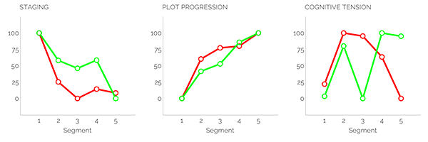
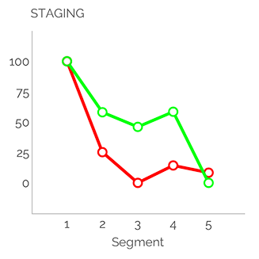
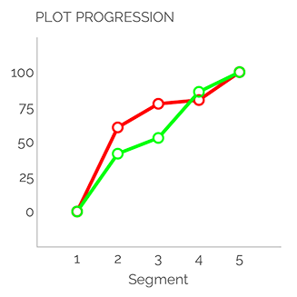
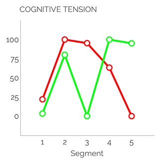
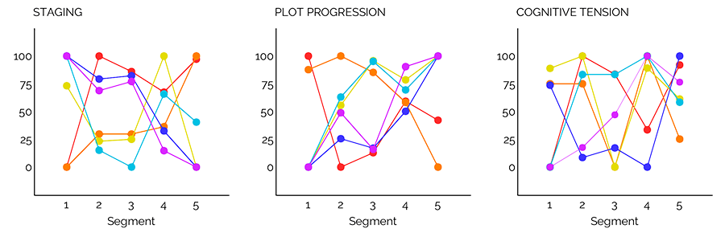

It seems appropriate somehow that my first opportunity to wish a "Happy New Year" to readers of ***Mythaxis*** comes with 2023 already a quarter gone. After all, time is accelerating ever faster by the day, as my grandfather probably once assured my teenaged me (now I see he was right all along, but I should have known – that's science fiction readers for you). Nevertheless: it's nice to have you back again, and I hope you enjoy our six new stories this time around.

Also pleasing to announce is that, no doubt after a period of extended visitation, Les Sklaroff has provided a new entry in the ***[Sketches of Snoak City](https://mythaxis.co.uk/SnoakCity/24-togger-chorps-story.html)***, which you can find at the link!

In addition to these, I'm happy to welcome our first non-fiction contributor to the team. Mattia Ravasi has many years of long-form fiction reviewing under his belt, and will be sharing essay-writing duties on an alternating basis with… *with one whose identity shall remain secret, until our* next *issue lands!* Both of their detailed insights will be joined each issue by a selection of my own more fleeting recommendations in a selection of recent short stories appearing in other venues, as (and I'm sure we can all agree on this) *you can never have too many things to read.*

In addition to *your* kind return, the style of ***Mythaxis*** itself has returned to its pre-Artificial Intelligence'd artistic mode. Read into it what you will (and for the time being you will have to do just that) but, after considerable experimentation with algorithmically generated images in 2022 and before, the magazine will forge ahead using only humanly assembled visuals. Any larger conversation about the use of AI in creative endeavours is, once again, being side-stepped here, regardless of how topical it currently is. Never let it be said I am afraid to wait until a boat has sailed before leaping from the pier, but I feel a more urgent call: to continue, and possibly finish, updating you on the progress of our AI publishing adjunct, the trusty Slushbot.

Unlike the large language models taking our contemporary world by storm, it's safe to say the Slushbot *isn't* shocking its flesh-and-blood masters due to astronomical advances in its sophistication with each new generation. All we're asking is that it demonstrate a comparable taste to my own when confronted with the ***Mythaxis*** slush pile, and frankly, it's doing awful.

On a basic level, it at least rejects more stories than it accepts, so that's something. From 161 submissions in our last window, it passed on 90. That's still enough acceptances to fill nearly three years of the zine, though, and I must say I take issue with what passed muster. It agreed with only **one** of my acceptances, and rated ten of my rejections higher; its top three picks were, shall we delicately say, *not even remotely my cup of tea*.

It rated somewhat better with regard to my shortlist, in a sense: half of the 28 stories I put aside for further consideration were among its acceptances; none of these was ultimately quite for me, but they were all at least decent subs, and in several cases just plain good. The same cannot be said of the 56 pieces it accepted from the 130 I couldn't wait to finish for all the wrong reasons.

Of course, this isn't terribly surprising. As noted before, the diminutive sample size the Slushbot is exposed to, and the variance and complexity of what we ask it to analyse (to say nothing of the foibles of the editor we demand it emulate), mean the chances of it identifying any kind of pattern in what rises to the top in my estimation are tiny in the extreme. There are interesting ways of looking at that complexity, though, as was teased in the [previous editorial](https://mythaxis.co.uk/issue-32/editorial.html).

The Mystery Line Graphs we presented then are the output of another instance of smart technology: the **Linguistic Inquiry and Word Count** (LIWC) system, the website of which describes it as the gold standard in software for analysing word use, and [it uses interesting metrics by which to do so](https://www.liwc.app/help/aon).

> The Narrative Arc analysis within LIWC-22 builds on previous research showing that storytellers tend to go through a unique "unfolding" of word use when constructing their narratives (Boyd et al., 2020):
>
> - First, they start by using lots of words that pertain to nouns and how they relate to one another: this is called **"Staging" language**.
> - Once the storyteller has set the stage, they often use less "Staging" language and begin to use more words that signal action, and words that imply a shared understanding of who is engaged in those actions, and how those actions are transpiring, and so on. This is the language that drives a story forward: **"Plot Progression" language**.
> - Importantly, all the while, most storytellers build and release psychological tension through some form of conflict: either by having characters struggle to attain their goals, or structuring situations in such a way to where it is uncertain whether characters' goals will be achieved. Traditionally, this **"Cognitive Tension"** rises and then peaks around the middle-to-later parts of a narrative.

I can't speak for anyone else, but I immediately found this fascinating. The narrative arc example representing *"a large collection of TED Talk speeches"* instantly rang true, and not in a good way. After initially enjoying TED Talks, I've now not listened to one for years due to the formulaic way they tend to be structured, and that's *exactly* what they feel like to me: *samey*. 

Same wandering delivery. Same easily-digestible lengths. *Same start-and-finish timing of triggers to please their* (same?) *audience*. Even that same opening audio rush sets my teeth on edge now. But then I *am* a curmudgeon…

…*who likes good fiction!*

We decided to try out LIWK on the record of stories accepted and rejected by ***Mythaxis*** to see what it might show us, and such was the clearer of the two redacted graphs we shared last time. So here it is again, this time with the legend intact – the green line represents the zine's Acceptances, the red line our Rejections:

What might this tell us? Let's look at them one by one:

Both lines start high and fall, which is consistent with the theory's claim that stories tend to use **staging language** to set the scene, which then features less as they progress. It appears that the staging language of our acceptances tends to decline much slower, even rising again before the end, while in rejections the staging language drops abruptly and remains low thereafter.

Speculation now, and remember these graphs show aggregations of data from multiple source texts, but this might reflect a general need to establish more complex scenarios is typical for acceptances.

In terms of **plot progression**, both lines show the predicted upward trend from the theory: with the stage set, the action sets off and increases progressively. There is little to differentiate here, though (as seems logical) the rejected stories show a more abrupt rise in plot progressing language, reflecting their faster transition away from staging language.

A further speculative observation: the accepted stories appear to satisfy the increasing demand of timely plot progression despite greater use of staging language throughout the (average) text.

It is in **cognitive tension** we see the most obvious diversion between the accepted and rejected stories. Again, these are averages (and the rejections include many times more source texts than the pieces we've accepted for publication), however it appears that while both groups enjoy an early spike in cognitive tension, indicating the potential for early reader interest, the rejected stories then show a steadily accelerating decline towards a very low end state. Acceptances instead follow that first spike with a sharp central decline, which is then followed by another abrupt spike that is more or less maintained to the end of the graph.

Taking these three graphs together, allow me to make summary speculations regarding both groups:

- **Acceptances**: After setting the opening scene, the average acceptance grabs the reader's attention quickly, then takes the time to reestablish their understanding of an evolving situation that goes on to defy expectation.
- **Rejections**: By contrast, while still achieving a solid foundation with regard to staging and plotting, the average rejection fails to surprise after its central hook is established.

You might see a hint of bias in *my* use of language there, but given the context that might be expected.

This editorial has stretched on long enough, I think, but to close it out we'll share one more graphic to underline once more an important point. The tidy graphs above suggest that what we like is just one thing… but that couldn't be further from the truth.

The graph below shows the last six stories ***Mythaxis*** accepted in 2022:

I think it's safe to say that they could hardly be more different, in each of the three categories.

Long may we receive such bountiful variety.
