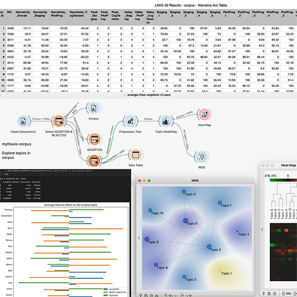
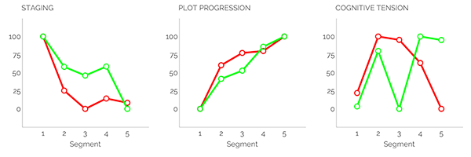

Over roughly the last twelve months, the ***Mythaxis*** team conducted a generally light-hearted experiment in applying AI technology to short fiction publishing. We used the cutting edge tools of the day to create an artificial intelligence so familiar with the tastes of the editor that we could task it with evaluating all submissions to the slush pile on his (that is, *my*) behalf. One day, when it had proved itself to our satisfaction, we could hand over the reins of ***Mythaxis*** to the "Slushbot" entirely.

Or at least, that's how we framed it.

We talked about our experiment as if one day it's going to wake up like the AI-Pinocchio of online magazine publishing. But that was never going to happen. We weren't training an artificial intelligence at all, an *artificial*-artificial intelligence would be closer to the truth. In fact, what we did was considerably more mundane, though still interesting from our perspective.

So, while you can also read the glamorised version of the story in our recent editorials (see Issues [31](https://mythaxis.co.uk/issue-31/editorial.html), [32](https://mythaxis.co.uk/issue-32/editorial.html), and [33](https://mythaxis.co.uk/issue-32/editorial.html)), I'd like to take a moment to discuss more seriously what we were, and were not, doing behind the scenes during the last year.

I'll start with a negative. The world has become [both enraptured and/or outraged](https://medium.com/@emilymenonbender/talking-about-a-schism-is-ahistorical-3c454a77220f) by the arrival of Large Language Model (LLM) "artificial intelligence" text generators – *ChatGPT* being the most famous – and the visually stunning output of "generative" image systems, such as *Midjourney*.

These were not the tools that we used, and for several good reasons.

First and foremost, at the current point in the development of such systems there are [ethical question marks](https://towardsdatascience.com/the-invisible-workers-of-the-ai-era-c83735481ba) hanging over them which we find concerning. Generative systems need to be trained on vast quantities of material (millions or billions of images; [countless lines of text](https://www.vice.com/en/article/wxnaqz/ai-isnt-artificial-or-intelligent)), and there is at least the possibility that some of that material was harvested and effectively reproduced in a comparable form without permission.

The implications of this are far-reaching, not least the question of who can legally be considered the "author" of a work that is created by a so-called AI. [Is it the software developers who coded the tool?](https://programmedinequality.com/) Is it, even, the tool itself? Or *is* it the person who entered a prompt and received what they asked for? Regardless, we should also ask what rights and credit are owed to [those whose work the tools were trained upon](https://www.vice.com/en/article/wxn3kw/openai-used-kenyan-workers-making-dollar2-an-hour-to-filter-traumatic-content-from-chatgpt), with or without their permission.

Until satisfactory answers are provided, LLMs and art-gen tools are problematic. Therefore, though we have experimented with image-generating AI tools in our less well informed past, we shall not do so again in future. For similar reasons, we don't invite submissions of AI-generated stories for publication, because it is far from clear who the true author of any such text would be.

The second reason we didn't use generative tools is much simpler: our objective wasn't to create anything, at least not in the sense of *writing a story* or *painting a digital picture*. We wanted to make a tool, not a product, a tool with only one application: *predicting what kind of stories the editor of **Mythaxis** likes to publish*.

Let's take a look at how we tried. And failed.

Fundamentally, what we dipped into was the rollercoaster thrill-ride called *data analytics*. This is the toolkit of academics working in fields such as "digital humanities", "distant reading", "data science", and (a label now maybe more familiar to the general reader thanks to events of the last few years) "machine learning".

So far, I have published exactly 99 stories as editor of Mythaxis. I have rejected approximately 20 times more than that in total. We wanted to know more about this body of data: *out of over 2,000 stories, what made those few stand out?* Obviously, a key factor was the editor's taste in fiction, but we wondered how that very abstract concept might actually be represented in the raw data.

To learn more, we divided our submissions into three categories:

1. Acceptances (the stories we decided to publish)
2. Rejections (the stories we did not)
3. Better-rejections (ones which made our shortlist)

The stories were then anonymised and analysed individually, with the resulting data aggregated into those categories. And then we analysed the aggregated data as well. What we called "the Slushbot" was really just the statistical output of a number of software tools that look at data and try to identify patterns.

Over the period of our experiment we used the following workflow:

> Whenever the window opened, the editor would read all the new submissions and make a decision about accepting or rejecting them. Simultaneously but separately, our tools would analyse the contents of the slush pile, compare the statistical data with that of past *acceptances* and *rejections*, and make a prediction about which category each new submission fell into. At the end of the window, we compared those predictions with my actual choices, then updated the overall body of data to reflect the facts, hopefully improving the accuracy of its future performance.

In the event that these predictions came to reflect my actual decisions, this could be a very valuable resource. ***Mythaxis*** is a small operation; I always read all submissions, but this takes a lot of time and effort. Perhaps a trustworthy tool could be used to order the slush pile according to predicted acceptance rating, or simply to highlight what it considers strong candidates for immediate attention. Either of these approaches could make a significant difference in what sometimes seems a very daunting task.

So, we tried this for about a year, and... to say the least, the results were not good. Instead of identifying the mere seven or so stories that would make the final cut in each window, it would routinely categorise as many as half the submissions as "acceptances", which would have led to issues featuring around a hundred stories each. As for its assessment of my actual selections, they were more often rejected than not, according to the data.

There are reasons for this, of course. Even a couple of thousand stories is not a big data set. Still worse for our analysis, the kinds of stories that get submitted to us can vary in incredibly diverse ways: they range in length from 1,000 to over 7,000 words; they use different regional styles and spellings of English; they represent wildly different subgenres under the general umbrella of "speculative fiction". 

It is hardly surprising that even remotely coherent patterns were not forthcoming.

We used a number of different software tools for our analysis. Our original attempt used [SetFit](https://github.com/huggingface/setfit), a machine learning classifier; then we turned to [SBERT](https://sbert.net/) to explore "embeddings", a mathematical representation of data, in our case linguistic data, such that each word, sentence, or paragraph can be compared against others to determine a degree of similarity or association. It is these associations that (we hoped, in vain) would allow distinctions to be identified between the categories we chose.

We also used [Orange Data Mining](https://orangedatamining.com/) and the research methodology of [distant reading](https://en.wikipedia.org/wiki/Distant_reading) (see also [here](https://www.digitalhumanities.org/dhq/vol/11/2/000317/000317.html)) to explore and visualise a variety of linguistic patterns in the data. In all cases, we were careful to work with these tools locally, never sharing data with organisations that could put it to uses outside of our control.

Arguably our most encouraging find was [LIWC-22](https://www.liwc.app/), a linguistic analysis software used to help identify which narrative qualities ***Mythaxis*** "looks for" when accepting or rejecting a story submission. This involves focusing down on how different parts of language and language use (verbs, pronouns, punctuation, speech acts, narrative tone, cognitive tension, story tropes, categories and topics, etc) feature in a text.

One thing which many of these tools have in common is, at least to my unskilled eye, *incomprehensibility*. The following image gives you a very general sense of what working with them looks like, and I'm glad that side of things is safely in the hands of my technical partner at the zine, Marty Steer:

Fortunately for me, LIWC stood out for the relative accessibility of its information output, being able to produce simple graphs suitable for an [editor-level degree of interpretation](https://mythaxis.co.uk/issue-33/editorial.html):

Whether my interpretations were correct or not is another matter entirely!

We've now decided to draw a line under our little experiment. We went into it more to investigate a fun possibility than with any realistic expectations of success; but there comes a time when the futility takes the edge off that fun – and, frankly, framing our experiment in the context of AI became less and less satisfying as the potential social impact of contemporary technology made itself clearer. And with that said, we still have at least the shadow of an elephant in the room, I think.

There is an admitted similarity between how LLMs are trained and the way we studied the submissions we received, and authors might understandably worry about that. Yes, true, in both cases texts undergo statistical analyses: the tools examine their sources of data in detail, looking for patterns upon which to perform their functions. The critical difference lies in what the ultimate objectives of those functions are.

LLMs and other generative tools use the statistical data they amass to generate outputs of a similar kind. If you train them on works of fiction, they become *fiction simulators*: machines that make texts *with similar characteristics to* a story. 

I choose my words carefully here: not to get into the semantics of it, but unless a human agent is directing them very closely, I don't think LLMs make actual *stories* at all – just something very story-*like*. Even given a human agent in that directing role, as we've said, the question of whether that person really is "the author of the text" is debatable at best.

By contrast, the tools we worked with only output statistics. If you feed them stories, they don't become capable of making story-like texts. They just gave us a new way to look at what was actually there in the slush pile. And, as an editor, what I always want to know is whether *what is there* is a story I will like, or a story I won't.

We probably never would have succeed in making a tool that could tell me that with any accuracy. Maybe it would be cool if we had? But, just as there is no substitute for having humans create works of fiction, there's no substitute for humans reading them either.

