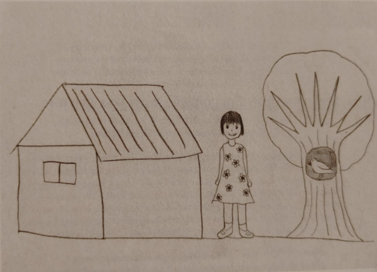

Not long ago, I learned about a Youtube phenomenon that I’m told is a real phenomenon in Japan. An artist, who goes by the stage name Uketsu, their true identity obscured by a somewhat eerie disguise, presents, through videos, puzzles for their audience to solve. The puzzles take the form of several crude, but clear, drawings done by Uketsu, and other kinds of strange visuals. I would paint a better picture of what these videos are like, except they’re all in Japanese, without an English subtitle option. What is evident, however, is that the mixture of visual puzzles presented by a slightly unsettling figure has had such an impact that the cultural swath being cut has extended into the Western world.

Two novels that Uketsu wrote based on his visual mysteries have been translated into English by Jim Rion. I became aware of all of this through the publication of the first one, *Strange Pictures*, which I thought offered a potentially new take on the horror genre (the author's pen name, Uketsu, most likely refers to the Kenji Mizoguchi's classic horror film *Ugetsu*, adapted from an 18th century story collection by Ueda Akinari called *Ugetsu Monogatari*). Let’s face it, the genre is entering into — or perhaps that should be *is in the middle of* — a particularly moribund period. As more horror writers are breaking into mainstream success, the more narrow will become the ambitions — stylistically, formally, thematically, narratively — of those just starting out. The market has shown what sells, so that’s what will be offered. The upside to this kind of situation is that interesting work can find a way in, usually by accident. At any rate, that’s what I was hoping for from *Strange Pictures*.

*Strange Pictures* is broken into four chapters and a prologue. As the reader finishes the first chapter and begins the second, they may be forgiven for thinking that what they were reading a collection of similarly themed short stories rather than a novel. As one eerie story about the meaning behind a mysterious blog fades, and a new one about a single mother who is routinely followed home from picking up her son at daycare by a strange man, they might mentally change gears slightly. But one of the features of *Strange Pictures* that make it initially intriguing is the slow realization that all of these stories are connected — subtly at first, but soon more and more directly. How wide will these mysteries spread? Or how narrow will become its focus?

When a story’s central mystery is kicked off by the most seemingly innocent image possible, it’s hard to not become almost instantly under the writer’s thrall. In this novel’s prologue, Uketsu hits us with this:

The picture is being shown to a group of students by a doctor, who informs them that it was drawn by a little girl who was currently confined in a mental institution after killing her mother. The doctor goes on to interpret each element of the picture, and how, sunny though the emotional surface of the drawing appear, it also reveals hidden clues to the patient’s psychological turmoil. This interpretation, it needs to be said, is rather wearyingly blunt in the symbols being extracted from the simple drawing in order to construct it, while also being so complicated, almost Holmes-ian in its precise deductions, that one can’t quite imagine any human brain arriving at them. Then again, isn’t that part of the fun? You don’t read a Sherlock Holmes story in the hopes that by the end you’ll be able to say “Yep, Holmes nailed it, I was about to say the same thing.” 

In that first long chapter of *Strange Pictures*, “The Old Woman’s Prayer”, two college students, members of an on-campus club that studies paranormal phenomena, become obsessed with a blog called “Oh No, Not Raku!” Meant to be a daily diary of the pseudonymous author’s life, a gap of several years lies between the last, rather grim and cryptic entry, and the previous, comparatively cheerful one. What happened to this man and his wife, who, in the last clear blog entry about her, was about to give birth?

As you might guess, the only clues we’re given are the blog entries, and a series of illustrations the blogger’s artist wife made, inspired by her pregnancy and what the future may hold: drawings of their anticipated child at several stages of his or her life, another of an old woman praying, and so on. What these students are able to figure out based on the same meager information the reader is offered is, quite frankly, preposterous. No one could have ever arrived at the solution they arrive at, let alone then, also, have that solution turn out to be correct. So, if such things matter to you, that would go in the debit column for this book. However, in the credit column I would put a mark because that solution, while arrived at via a thread of logic so tortured and esoteric as to be nonsensical, is actually kind of eerie — *emotionally* eerie, which is a very particular type, and one not often encountered.

Chapter two, “The Smudged Room”, has a similar impact. Longer and even more convoluted, in its way, than “The Old Woman’s Prayer”, Uketsu gets so many plates spinning in the course its story that the fact that the woman and her young son were being followed on the way home from school would be forgotten by me for pages at a time, until Uketsu reintroduced it. The illustration at the heart of that chapter, by the way, is far cruder than those drawn by the expectant mother in the previous chapter – drawn by a child, it depicts an apartment building, a mother and son standing beside it, and with one window on the building’s top floor obscured by a cloud of crayon scribble. Why? Does it indicate that perhaps the boy is being abused by his mother?

Well, you guys wouldn’t believe the sorts of things all the different pictures in this novel would appear to be indicating. If the solution to the drawings in “The Old Woman’s Prayer” was preposterous, or if at least the arriving at it was, you ain’t seen nothing yet. And this, unfortunately is the great fault of *Strange Pictures*. As Conan Doyle proved, a certain level of ridiculousness, even unbelievability, is permissible when depicting a genius. But not only is there, even within those parameters, still a limit beyond which a reader will not travel, what is allowable is narrowed even further when the impossibly complicated puzzle at hand is being solved not by a Sherlock Holmes-level eccentric genius, but instead by college kids and determined journalists.

As the ridiculousness inherent to *Strange Pictures* deepens, or perhaps *transcends* our earthbound concerns about logic and reason, the story also considerably darkens, and becomes more violent. The very perverse mental state that is ultimately revealed in chapter three, “The Art Teacher’s Final Drawing”, could be more completely explored in a version of this story not so reliant on a gimmick. This chapter is also the longest, though not the slowest to read. This is because much of the page count is filled out with visuals – drawings, yes, but also charts. And not just charts, but utterly pointless charts. It will be revealed in the prose that, say, a murder victim woke up at 6:00, bought groceries at 7:15, and then arrived at the hiking trail entrance at 7:40. The reader reads that, and then sees a chart with that exact information, and only that exact information, filling up half the next page. More absurdly still, that chart will appear again, unchanged, at least once more before the chapter is over.

The final chapter, title "The Bird, Safe in the Tree", caps everything off by ruthlessly explaining every last detail of the mysteries that had been left unexplained by the previous chapter. Paradoxically, in doing so it actually heightens the horror element, dealing extensively as it does with the inner workings of a deranged mind. But as is so often the case, the consequence of such relentlessness is tedium.

But I have to admit, while all the criticisms against *Strange Pictures* that I’ve just made are genuine, and disappointing, problems, there is something about how the horror is buried within a kind of game for the reader to play that makes what is inflicted and experienced by the victims feel even more cruel, almost otherworldly – but, again, it’s an impossible game, an unwinnable game, and no one trying to honestly and fairly figure out any of these puzzles will achieve anything besides driving themselves mad.

I don’t know, in all honesty, if I’m up for giving Uketsu’s follow up novel, *Strange Buildings* (sounds positively Lovecraftian), a shot. *Strange Pictures* was too much of a mixed bag. If it works on you, though, I can imagine the possibility of more being hard to resist.

*Thanks for reading - but we'd love feedback! Let us know what you think of Bill's thoughts at [Bluesky](https://bsky.app/profile/mythaxis.bsky.social).*
