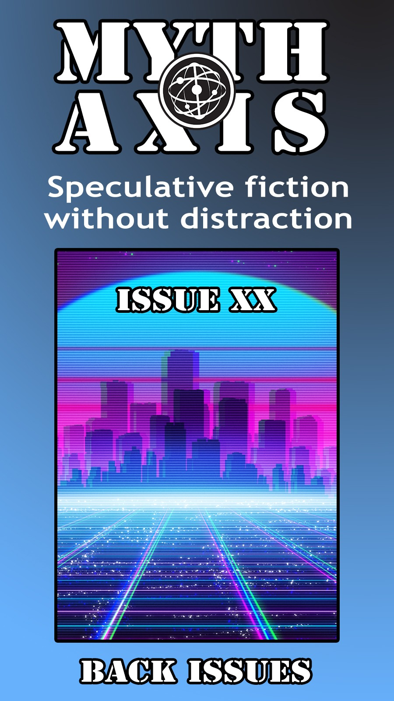
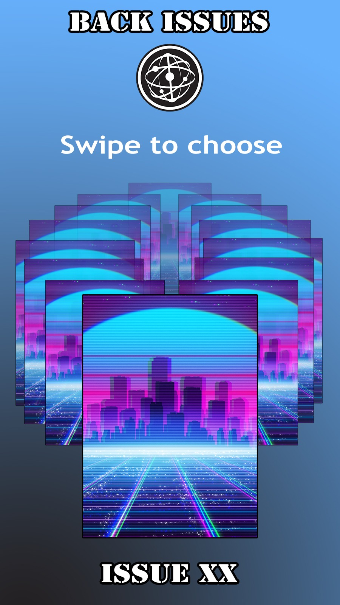

5.nebula-frontpage-and-issue-grid

issue images in back issues are not fully working. see issue-43.html. I'm also not seeing 'cover' art on the previous skin (though it appears when you select a story). In the new skin that is impacted by the current live issue - so it shows Frank Forestall as the cover artist no matter what issue you were looking at (the same way 'home' on the menu takes you back to live issues, not to the issue you were reading).

Maybe we could add an About page to each issue folder. A bit redundant, but I could just change the issue number and artist name after I duplicate the last folder (when I make the new issues).

Otherwise having a proper landing page would work quite nicely. the Mythaxis menu option would always take you there, even from the old issues. You can also ways go to the ToC on the old ones to switch between stories (or hit 'back' on your browser) and the new skin lets you swipe between issues too.

(Just to mention - I'm looking at my original redesign mockups, and: very glad you didn't follow them to the letter! The reality is way better than my funbled ideas :-))

Here's a quick mockup of a portrait/mobile interface for a master landing screen. I'll send something along for a landscape/laptop equivalent later).

starts here, showing the current 'live' issue as a clickable tile.

Then if you swipe the screen or tap the 'back issues'....

 the bottom half comes into view, with a left/right swipeable carousel. One tile for each modern issue (the very old ones we can leave on the archive, but we could also create an 'archive' tile on the carosel, perhaps ))

doesn't have to be all the tiles visible at once, of course!

and in fact, it could be that there is NO downward swipe: we just show the current issue front and centre, with the previous couple of issue tiles ghosting off to the left. And people can click the centre tile, or swipe (tap left/right on a keyboard) to slide the carousel.

and ghosting to the right of the live issue could be a sinlg etile that holds the landing page blurb, which also had supportr and submit buttons.

better still!: three 'info' tiles live to the right of the current issue:

1) [mythaxis blurb] shows some general info, more or less what is on the 'about' page.
2) 2) [Support us on Ko-fi] intros the Ko-fi pages (until I do something like make a pattern).
   3) 3) [Submissions] gives us the subs info and link.